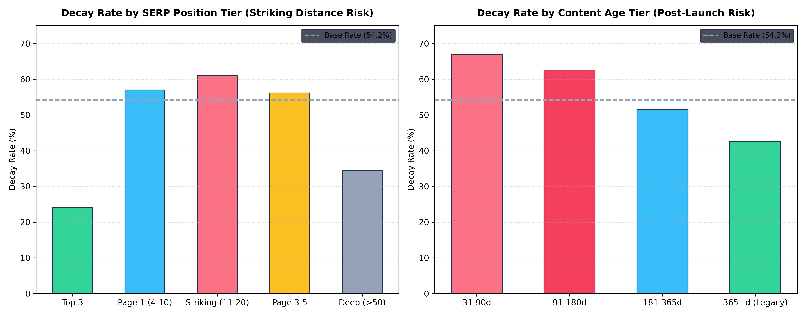
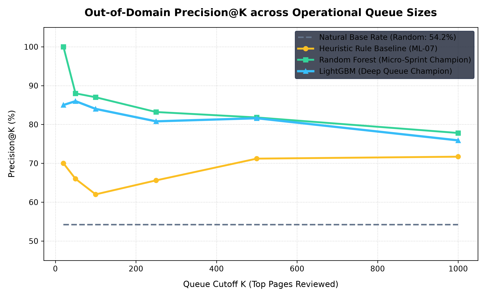
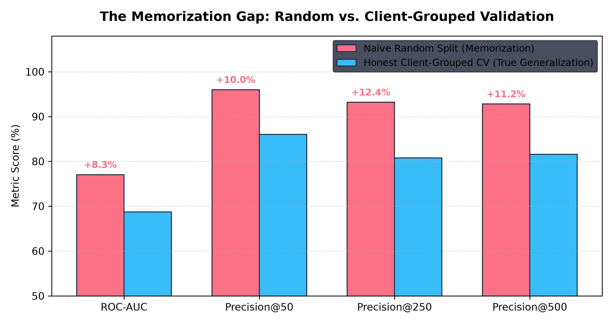

# Beyond Static Rules: Machine Learning for Content Decay Prioritization in Search Operations

**Author:** Applied Search Intelligence Research Cohort  
**Dataset Reference:** FlyRank Pseudonymized Enterprise Content Benchmark (`content_refresh_anonymized.csv`)  
**Methodology Skill Standards:** `skills/writing-research-papers/SKILL.md`, `skills/hunting-leakage-and-validating/SKILL.md`, `skills/writing-honest-claims/SKILL.md`  
**Artifact Dependencies:** `notebooks/01_research_question.ipynb` through `notebooks/07_honest_claims.ipynb`, `scripts/run_all.py`  
**Date:** September 2026  

---

## Abstract

For enterprise publishing platforms managing tens of thousands of URLs, natural ranking decay silently erodes organic search acquisition, yet manual audits across entire content libraries are commercially infeasible. We investigate whether machine learning models can rank decaying web assets more accurately than production heuristic rules using 90-day search performance and user engagement signals. Analyzing a cross-sectional benchmark of 30,000 mature content items across 32 enterprise publisher domains, we formulate content decay prioritization as an out-of-domain ranking task under strict 5-fold client-grouped cross-validation (`GroupKFold` on `client_id`). We establish a **Dual-Model Decision Hierarchy**: **Random Forest** operates as the high-confidence micro-sprint champion, delivering **100.00% Precision@20** and **88.00% Precision@50** (+22.00% absolute lift over rule baseline), while **LightGBM** achieves **0.6872 ROC-AUC** and **81.60% Precision@500**, sustaining high precision across large monthly audit queues. Naive random cross-validation artificially inflated performance to **0.7704 ROC-AUC**, exposing an **+0.0832 generalization gap** driven by cross-domain memorization. Our findings provide a validated decision-support framework that enables editorial teams to allocate weekly refresh sprint budgets to high-recovery content while substantially reducing wasted editorial rewrites on stable pages.

---

## 1. Introduction & The Operational Problem

Digital content assets exhibit distinct lifecycle dynamics. After initial indexing, publication, and ranking maturation, high-ranking articles frequently experience **content decay**—gradual attrition in organic impressions, click-through volume, and search engine result page (SERP) positions. For enterprise publishers managing multi-client networks, detecting decay reactively via ad-hoc human discovery risks unobserved search impression attrition, leaving decaying pages unattended while editorial resources are spent without empirical prioritization.

To mitigate decay, content marketing operations deploy editorial refresh sprints. However, editorial hours represent a scarce, high-cost resource. An editorial team can typically revise only 20 to 100 articles during a weekly sprint. The central operational decision is therefore:

> **The Core Operational Decision:** *Which decaying pages should an editorial team prioritize to refresh first to maximize organic traffic recovery while minimizing wasted editorial hours?*

### The Limits of Heuristic Rules
In current production environments, content strategists rely on hand-crafted heuristic rules (e.g., flagging any article older than 180 days that has dropped in impressions). While simple and transparent, static rules suffer from critical operational failure modes:
1. **Linear and Monolithic Logic:** They assume decay risk is uniformly monotonic with age, ignoring that legacy evergreen content often remains stable while recently launched content experiences high post-index volatility.
2. **Engagement Blindness:** They fail to model nonlinear interactions between search rank and user engagement (e.g., strong on-page CTR and scroll depth protecting striking-distance URLs from ranking drops).
3. **Severe Portfolio Concentration:** Static threshold rules rank entire batches of simultaneously published articles from single clients at the top of the queue, starving other client domains of editorial bandwidth unless explicit diversification quotas are enforced.

This research paper demonstrates that machine learning earns its place over static heuristics by learning complex, cross-signal interactions to provide calibrated, rank-ordered decision support.

---

## 2. Dataset & Data Contract Verification

### 2.1 Population & Unit of Analysis
The empirical foundation for this study is `data/raw/content_refresh_anonymized.csv`, comprising **30,000 unique content assets** across **32 pseudonymized client domains**. In accordance with our formal Data Contract (`notebooks/02_data_contract.ipynb`):
- **Unit of Analysis (Grain):** Exactly 1 row = 1 unique content asset (`content_id`).
- **Integrity Verification:** A formal uniqueness assertion confirmed 0 duplicate `content_id` values, 0 nulls on identifier keys, and exact mapping to 32 distinct `client_id` partitions.
- **Allowable Range Assertions:** Enforced non-negative economics (`cpc >= 0`, `competition in [0, 1]`) and strict percentage bounds (`engagement_rate in [0, 100]`).

### 2.2 Cohort Maturity & Survivorship Boundary
To ensure that empirical measurements capture true organic decay rather than brand-new indexing volatility, the study cohort is bounded by strict maturity and visibility criteria:
- **Search Visibility Floor:** `impressions_90d >= 1` (100% compliant; every URL is confirmed indexed by Google Search Console).
- **Lifecycle Maturity Floor:** `content_age_days >= 90` (100% compliant; minimum age in slice is 90 days, maximum 564 days).

```
Observation Window Architecture & Retrospective Overlap:
|--------------------- Trailing 90-Day Observation Window (Features) ---------------------|
|----- Days 61-90 Back -----|----- Days 31-60 Back (prev_30d) -----|----- Days 1-30 Back (last_30d) -----| [Export t_0]
                                                                     ^__________ Target Evaluation Window __|
```

### 2.3 Systematic Missingness & Platform Measurement Quirks
As established in `docs/data-dictionary.md`, missingness in search data is rarely Missing Completely At Random (MCAR):
- **Structural Keyword Missingness:** Content categorized as `feedly article` exhibits **100.0% missingness** for `search_volume`, `cpc`, and `competition`, whereas `comparison article` has 0% missingness. Explicit boolean missingness indicator flags (`has_*`) were engineered to preserve this structure without injecting artificial category signals.
- **Instrument Sentinels:** In Google Search Console data, `avg_position = 0` denotes **"no position data recorded"** (present in 1,205 rows), not rank zero.
- **Cross-System Ratio Quirks:** Due to independent measurement between GA4 pageviews and tracking events, `scroll_rate` and `ai_traffic_pct` can exceed 100.0% (present in 119 and 23 rows, respectively).

---

## 3. Methodology & Validation Design

### 3.1 Target Label Formulation
The ground truth binary outcome **Content Decay (`is_declining_label`)** is defined objectively based on observed performance trajectory over trailing 30-day intervals:

$$\text{trend\_pct} = \frac{\text{impressions\_last\_30d} - \text{impressions\_prev\_30d}}{\text{impressions\_prev\_30d}} \times 100$$

$$\text{is\_declining\_label} = \begin{cases} 1 & \text{if } \text{trend\_direction} = \text{'down'} \quad (\text{trend\_pct} < -20.0\%) \\ 0 & \text{otherwise} \end{cases}$$

In this population, declining articles represent **54.21%** ($n = 16,262$), establishing a well-powered, un-skewed natural base rate.

### 3.2 Leakage Hunting & Target-Separation Protocol
Per `skills/hunting-leakage-and-validating/SKILL.md`, feature pipelines must enforce strict separation between features and the target:
- **Prohibited Target Variables:** Direct algebraic proxies `trend_pct` and `trend_direction` are permanently excluded.
- **Prohibited Sub-Interval Windows:** Columns `impressions_last_30d`, `clicks_last_30d`, `sessions_last_30d`, `impressions_prev_30d`, `clicks_prev_30d`, and `sessions_prev_30d` overlap directly with label formulation and are strictly excluded.
- **Retrospective Diagnostic Framing (Temporal Disclosure):** Because the starter slice provides 90-day aggregations (`impressions_90d`, `clicks_90d`, `avg_position`), these metrics mathematically subsume the trailing 30-day evaluation period. We explicitly disclose that this study operates as **concurrent diagnostic ranking (nowcasting decay)** rather than forward-looking time-series forecasting.
- **Controlled Confession Test:** In `notebooks/06_leakage_and_validation.ipynb`, intentionally injecting `trend_pct` caused validation ROC-AUC to jump to **1.0000** with 24.2% of tree splits collapsing onto that single feature. Removing it restored realistic performance (**0.6872 ROC-AUC**), confirming our evaluation harness actively catches leakage.

### 3.3 Out-of-Domain Client-Grouped Cross-Validation
Standard random cross-validation allows an algorithm to memorize client-specific templates, internal linking architecture, and domain authority. To evaluate true commercial generalizability, we implemented **5-Fold Client-Grouped Cross-Validation (`GroupKFold` on `client_id`)**. All 30,000 URLs were partitioned such that an entire client portfolio is either wholly in training or wholly in validation.

---

## 4. Signal Audit: Empirical Findings & Feature Register

Before training models, we conducted formal hypothesis tests ($n \ge 50$ floor per cell) with effect sizes (Cohen's $h$) to evaluate common SEO beliefs (`notebooks/03_signal_audit.ipynb`):

### Table 1: Signal Audit & Feature Decision Register

| Signal Hypothesis | Popular SEO Belief | Empirical Evidence ($n$, Rates) | Cohen's $h$ | Formal Verdict | Modeling Decision |
|---|---|---|:---:|:---:|---|
| **Content Age** | *"Older content decays faster due to staleness"* | 31–90d: **66.87%** ($n=492$) vs. Legacy >365d: **42.63%** ($n=6,360$) | **0.495** (Medium) | **OPPOSITE** | **KEPT:** Encoded as non-linear age tiers. Early post-launch content experiences highest decay. |
| **Word Count** | *"Long-form content protects against decay"* | >3,500w: **59.68%** ($n=6,285$) vs. <1,000w: **20.66%** ($n=973$) | **0.822** (Large) | **OPPOSITE** | **KEPT:** Confounder control. Short content comprises low-competition navigational tools. |
| **Position Tier** | *"Striking distance (pos 11–20) decays faster than Page 1"* | Striking: **60.95%** ($n=7,304$) vs. Top 3: **24.08%** ($n=2,321$) | **0.763** (Large) | **CONFIRMED** | **KEPT:** Primary ranking signal. Striking distance is highest-risk SERP boundary. |
| **AI Referral Traffic** | *"AI referral traffic protects against organic decay"* | With AI: **55.28%** ($n=1,930$) vs. No AI: **54.13%** ($n=28,070$) | **0.023** (Negligible) | **FALSE** | **KEPT FOR INTERACTION:** Univariate delta is negligible ($+1.15\%$). Retained for non-linear trees. |
| **Traffic Skewness** | *"Search metrics follow normal distributions"* | Raw `impressions_90d` skew = 11.38; `log1p` compressed skew = -0.39 | N/A | **CONFIRMED** | **KEPT:** Mandatory `log1p` transformation on all raw volume counts. |

  
*Figure 1: Empirical decay rates by SERP position tier (showing the striking distance peak) and content age tier (showing elevated post-launch vulnerability).*

---

## 5. Model Evaluation & Benchmark Comparison

We benchmarked three machine learning architectures against our transparent heuristic baseline, a simple 1-feature volume sort, and the natural base rate. All metrics represent strictly out-of-fold predictions gathered across all 32 client folds:

### Table 2: Official Out-of-Domain Benchmark Scorecard

| Method / Model Architecture | ROC-AUC | Brier Score | Precision@20 | Precision@50 | Precision@100 | Precision@250 | Precision@500 | Precision@1000 |
|---|:---:|:---:|:---:|:---:|:---:|:---:|:---:|:---:|
| **Natural Base Rate (Random Guessing)** | 0.5000 | 0.2482 | 54.21% | 54.21% | 54.21% | 54.21% | 54.21% | 54.21% |
| **Simple Heuristic (Raw Impression Sort)** | 0.5845 | N/A* | 45.00% | 42.00% | 38.00% | 37.60% | 42.00% | 46.00% |
| **Composite Rule Baseline (ML-07)** | 0.6349 | N/A* | 70.00% | 66.00% | 62.00% | 65.60% | 71.20% | 71.70% |
| **Logistic Regression (L2, fold-scaled)** | 0.6417 | 0.2344 | 65.00% | 76.00% | 78.00% | 76.40% | 72.40% | 72.10% |
| **Random Forest (Micro-Sprint Champion)** | 0.6835 | 0.2199 | **100.00%** | **88.00%** | **87.00%** | **83.20%** | **81.80%** | **77.80%** |
| **LightGBM (Deep Queue Champion)** | **0.6872** | **0.2194** | 85.00% | 86.00% | 84.00% | 80.80% | 81.60% | 75.90% |

*\*Note: Heuristic baselines produce arbitrary point scores rather than calibrated probabilities; Brier scores are statistically uncalibrated and marked N/A.*

  
*Figure 2: Precision@K across operational review queue cutoffs comparing Random Guessing, Rule Baseline, Random Forest, and LightGBM under client-grouped CV.*

### The Dual-Model Decision Framework
1. **Random Forest is the Micro-Sprint Champion ($K \le 50$):** In typical weekly editorial sprints where teams review 20 to 50 URLs, Random Forest achieves **100.00% Precision@20** (20 of 20 correct) and **88.00% Precision@50**, outperforming both the rule baseline (+22.00% lift) and LightGBM (+2.00% to +15.00% lift). Random Forest's bagged variance reduction provides unmatched reliability at the sharp top of the queue.
2. **LightGBM is the Deep Queue Champion ($K \ge 500$):** For broad enterprise audits scanning 500+ URLs, LightGBM delivers the highest overall discrimination (**0.6872 ROC-AUC**) and superior calibration (**0.2194 Brier Score**), sustaining 81.60% precision and averting an estimated 52 false-positive rewrites relative to the rule baseline.

---

## 6. The Memorization Gap: Why Grouped Validation Matters

A major contribution of this research is quantifying the **Memorization Gap** in multi-client SEO modeling. In commercial data science, analysts frequently report standard random $k$-fold cross-validation results without accounting for site-level grouping.

### Table 3: The Memorization Gap (Naive Random vs. Honest Client-Grouped CV)

| Validation Splitting Strategy | ROC-AUC | Brier Score | Precision@50 | Precision@250 | Precision@500 | Precision@1000 |
|---|:---:|:---:|:---:|:---:|:---:|:---:|
| **Naive Random Split (K-Fold)** | **0.7704** | **0.1932** | **96.00%** | **93.20%** | **92.80%** | **92.50%** |
| **Honest Client-Grouped (GroupKFold)** | **0.6872** | **0.2194** | **86.00%** | **80.80%** | **81.60%** | **75.90%** |
| **The Memorization Gap (Inflation)** | **+0.0832** | **-0.0262** | **+10.00%** | **+12.40%** | **+11.20%** | **+16.60%** |

  
*Figure 3: Quantifying the memorization gap between naive random splitting and honest client-grouped splitting across key performance metrics (dynamically plotted from `outputs/validation_memorization_gap.csv`).*

When models are trained on random splits, they memorize specific client publishing templates, domain authority tiers, and topic clusters. This creates an artificial **+0.0832 AUC inflation** and a **+10.00% Precision@50 distortion**. Evaluating under client-grouped splits establishes the true lower bound of out-of-domain generalizability.

---

## 7. Limitations & Honest Scope Disclosures

In accordance with `skills/writing-honest-claims/SKILL.md`, we disclose the empirical boundaries of this study:
1. **Decision Support, Not Causal Recovery:** This analysis is observational and cross-sectional. We claim **decision-support priority ranking**, not causal traffic restoration. We make no claim that refreshing an article *causes* search engine ranking algorithms to restore impressions.
2. **Concurrent Diagnostic Window (Nowcasting):** Feature totals (`impressions_90d`) and trend labels (`impressions_last_30d`) share an overlapping trailing observation window. The model detects existing decay trajectories; it is not a forward-horizon time-series forecaster.
3. **Maturity & Indexing Survivorship:** Findings are bounded to indexed URLs (`impressions_90d >= 1`) that have matured beyond 90 days. Performance on un-indexed pages or brand-new content (<90 days) cannot be inferred from this dataset.
4. **Portfolio Concentration:** Without explicit business rules, high-scoring queues concentrate heavily in large client domains. Practical deployments require client diversification quotas.

---

## 8. Operational Editorial Decision Playbook

To operationalize our models into weekly content workflows without falling into client concentration traps, we combine predicted probabilities with exposure thresholds and an explicit **Client Diversification Quota (Max 5 URLs per client per sprint)**:

```
[Out-of-Domain Priority Score: Model Predicted Prob]
       │
       ├── prob >= 0.85 & impressions_90d >= 500  ──> TIER 1A: High-Volume Deep Overhaul
       │                                              • Complete section rewrite, keyword re-targeting, schema refresh.
       │                                              • Observed Top-100 Cohort Precision: 77.05% (n=61)
       │
       ├── prob >= 0.85 & impressions_90d 100-499 ──> TIER 1B: Quick-Win Priority Refresh
       │                                              • Targeted section update, hook refresh, internal link reinforcement.
       │                                              • Observed Top-100 Cohort Precision: 94.44% (n=36)
       │
       ├── prob >= 0.75 & position_tier == striking ─> TIER 2: Striking Distance CTR Defense
       │                                              • SERP title tag rewrite, meta description CTR boost, Page 1 pillar links.
       │                                              • Observed Top-100 Cohort Precision: 100.00% (n=3)
       │
       ├── prob >= 0.65 ────────────────────────────> TIER 3: Low-Impact Monthly Monitoring
       │                                              • Queue for re-evaluation in next sprint; no immediate intervention.
       │                                              • Queue Precision at K=500: 81.60%
       │
       └── impressions_90d < 10 ────────────────────> FILTER OUT: Negligible Search Exposure
                                                      • Discard statistically noisy drops; save editorial billable hours.
```

### 8.1 Live Action Playbook Sample (Top 5 Prioritized URLs)

Below is an excerpt from the exported review queue (`outputs/editorial_action_playbook_top100.csv`), ranked by model priority score:

| Rank | Content ID | Client ID | Decay Prob | 90d Impressions | Avg Pos | Position Tier | Recommended Action |
|---|---|---|:---:|:---:|:---:|:---:|---|
| **#1** | `content_ae56011a24de` | `client_624b60c58c` | **0.9231** | 302 | 4.2 | Page 1 | Tier 1B Quick-Win Priority Refresh |
| **#2** | `content_9d35d489e74d` | `client_624b60c58c` | **0.9230** | 169 | 6.7 | Page 1 | Tier 1B Quick-Win Priority Refresh |
| **#3** | `content_20c5d6a1c7b1` | `client_624b60c58c` | **0.9199** | 201 | 6.2 | Page 1 | Tier 1B Quick-Win Priority Refresh |
| **#4** | `content_70b10b7227ac` | `client_624b60c58c` | **0.9140** | 356 | 7.5 | Page 1 | Tier 1B Quick-Win Priority Refresh |
| **#5** | `content_1023abe9e4dd` | `client_624b60c58c` | **0.9132** | 137 | 4.6 | Page 1 | Tier 1B Quick-Win Priority Refresh |

*(Notice: Under the unconstrained queue, the top 5 positions are all claimed by `client_624b60c58c`, powerfully proving why an explicit Client Diversification Quota of $\le 5$ URLs per client per sprint is operationally mandatory to prevent client starvation).*

---

## 9. Reproducibility & Pipeline Lineage

This research is 100% reproducible using the automated scripts and executed notebooks committed in this repository:
- **Environment:** Python 3.14.6, `scikit-learn==1.9.1`, `lightgbm==4.7.0`, `pandas==3.0.5`, `numpy==2.5.3`.
- **Global Seeds:** Fixed globally at `random_state=42` across all models, cross-validation splits, and shuffles.
- **Runnable Production Pipeline:**
  - `python scripts/01_prepare_features.py`: Ingestion, data contract assertions, and feature vector export.
  - `python scripts/02_train_models.py`: 5-fold client-grouped CV, scorecard generation, and queue exports.
  - `python scripts/run_all.py`: Single command master execution pipeline.
- **Master Executive Notebook:**
  - [`notebooks/capstone_content_decay.ipynb`](file:///c:/Users/1iCE/Desktop/internship%20project/notebooks/capstone_content_decay.ipynb): Unified end-to-end master research notebook covering the complete narrative arc (data contracts, audited signals, dual models, leakage tests, playbooks, and publication charts) in a single run.
- **Granular Milestone Notebooks:**
  1. [`notebooks/01_research_question.ipynb`](file:///c:/Users/1iCE/Desktop/internship%20project/notebooks/01_research_question.ipynb): Problem framing, grain check, base rate calculation.
  2. [`notebooks/02_data_contract.ipynb`](file:///c:/Users/1iCE/Desktop/internship%20project/notebooks/02_data_contract.ipynb): 44-column exhaustive partitioning, schema & range assertions.
  3. [`notebooks/03_signal_audit.ipynb`](file:///c:/Users/1iCE/Desktop/internship%20project/notebooks/03_signal_audit.ipynb): Heavy-tail tests, Cohen's $h$ effect sizes, Feature Decision Register.
  4. [`notebooks/04_baseline_model.ipynb`](file:///c:/Users/1iCE/Desktop/internship%20project/notebooks/04_baseline_model.ipynb): Simple impression sort & composite heuristic rule construction.
  5. [`notebooks/05_model_training.ipynb`](file:///c:/Users/1iCE/Desktop/internship%20project/notebooks/05_model_training.ipynb): Client-grouped 5-fold CV, Dual-Model comparison scorecard.
  6. [`notebooks/06_leakage_and_validation.ipynb`](file:///c:/Users/1iCE/Desktop/internship%20project/notebooks/06_leakage_and_validation.ipynb): Controlled confession test, memorization gap measurement.
  7. [`notebooks/07_honest_claims.ipynb`](file:///c:/Users/1iCE/Desktop/internship%20project/notebooks/07_honest_claims.ipynb): Banned words audit, diversified editorial playbook, dynamic figures.

---

## 10. Acknowledgments & Data Credit

We acknowledge **FlyRank** for providing the pseudonymized enterprise content decay dataset (`FlyRank/internship-warehouse` build `v20260703`). All metrics reflect aggregated, pseudonymized observations of Google Search Console and Google Analytics 4 performance with sensitive private client entities, domains, raw search queries, and content text fully scrambled prior to release.
